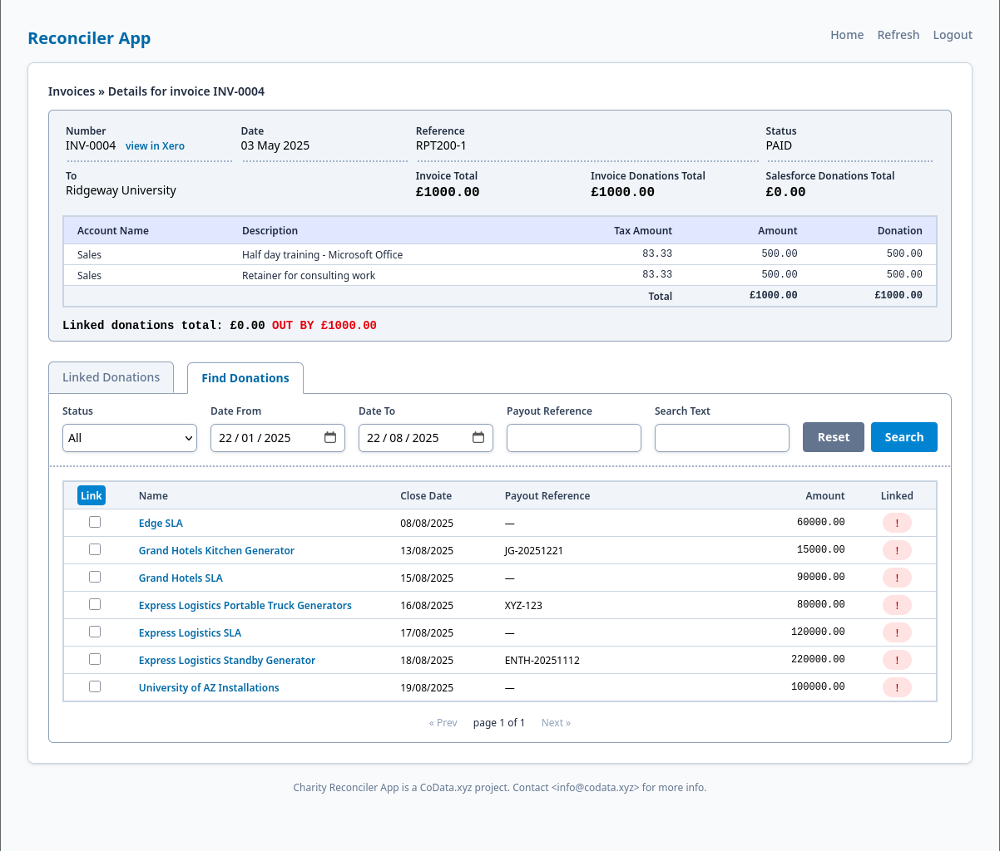

# reconciler

Reconciler is a cross-platform desktop webapp for UK charities wishing
to reconcile their financial records between their financial and CRMS
systems, acting as an Application Programming Interface (API) client to
the remote systems.

Reconciler is presently a work in progress, at early alpha testing
stage.

Xero and Salesforce integration is currently supported.

## Usage

Reconciler runs on a local system, using a local  [yaml configuration
file](config/config.example.yaml) to access the remote systems over
OAuth2 and to determine local operation. Both the accounting and CRMS
systems require OAuth2 access to be configured. Accounting and donation
information is synchronised to a local sqlite database.

## Licence

Reconciler is provided under a MIT licence.
