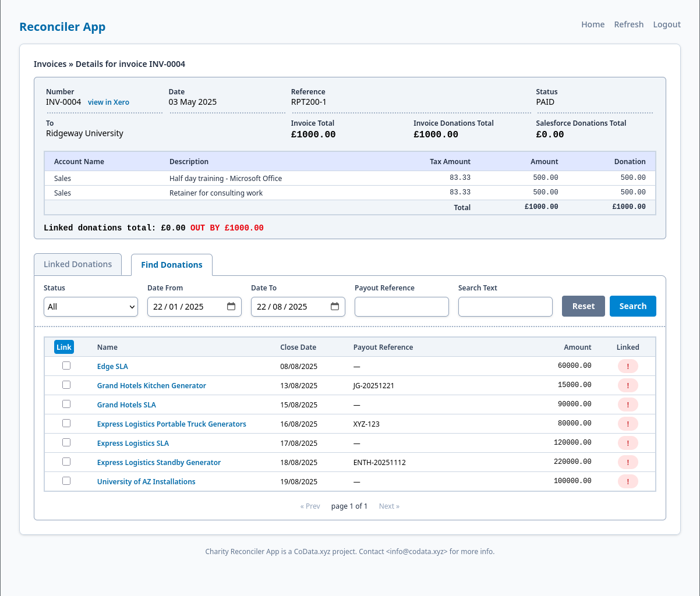

## reconciler

The `reconciler` app is a cross-platform desktop webapp for charities to
reconcile their accounts and CRMS systems to search, align and audit
donation income and records, presently focusing on Xero and Salesforce.

> [!CAUTION]
> Reconciler is in Beta testing. Backups of Salesforce data are
> recommended before use.

Reconciler draws records over OAuth2 secured API connections into a
local in-memory database to assist users to update a field in Salesforce
donation records to match an identifier from Xero invoices or bank
transactions. This process allows an organisation to bring the donation
totals for Xero income into reconciliation with the related Salesforce
donations.

### Reconciliation Mechanism

The reconciliation concept centres on the use of a unique linking key to
link an accounting income record to one or many donations in the CRMS
system.

For example, a bank transaction in Xero recording an income payment from
the JustGiving platform might be given a reference `JUST-GIVE-01122025`.
The Reconciler app can be used to find the related donation (or
"opportunity") records in Salesforce and add this reference to the
donation records' target field. Reconciler shows if the total donation
component of the Xero income (disregarding platform fees, etc.) for this
bank transaction equals the total related Salesforce donations, using
`JUST-GIVE-01122025` as the linking key. When the donation-related income
total equals the sum of related donations, the income and related
donations for this income are considered reconciled.

Reconciler is presently configured to use the Xero accounting invoice
`Invoice Number` or bank transaction `Reference` to link to data in a
custom field created on a Salesforce Non Profit Success Pack (NPSP)
object. The example configuration file shows a Salesforce
`Opportunity.Payout_Reference__c` as the linkage target. The linkage
target object and field in Salesforce is customisable.

### Security considerations

Please refer to the separate [security
documentation](./docs/security.md) for a discussion of the security
mechanisms and considerations of and in the use of the Reconciler app.

### Status

The project is in active development on a volunteer basis in partnership
with a UK charity and currently at early beta testing stage.

The project currently supports Xero and Salesforce with further
integrations envisaged in future.

### Usage

The project is developed using Go, Tailwind CSS and HTMX, deployable
with embedded assets on all major operating systems.

Reconciler runs locally, accessing the remote systems with OAuth2
authorized connections. A [yaml configuration
file](config/config.example.yaml) is used to configure settings such as
the OAuth2 client identifiers, the accounting account codes representing
donation income, the CRMS target linkage object and field, the
reconciliation start date, and other details.

A local in-memory sqlite database is used to provide search
capabilities. Connections to Xero are read-only, whereas only the target
linking field on the configured Salesforce object may be altered through
Reconciler operations.

### Licence

Reconciler is provided under the open-source MIT licence. Please read
the terms of the [licence](./LICENCE).
